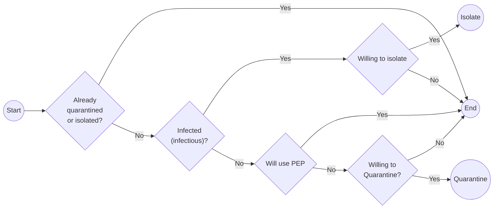
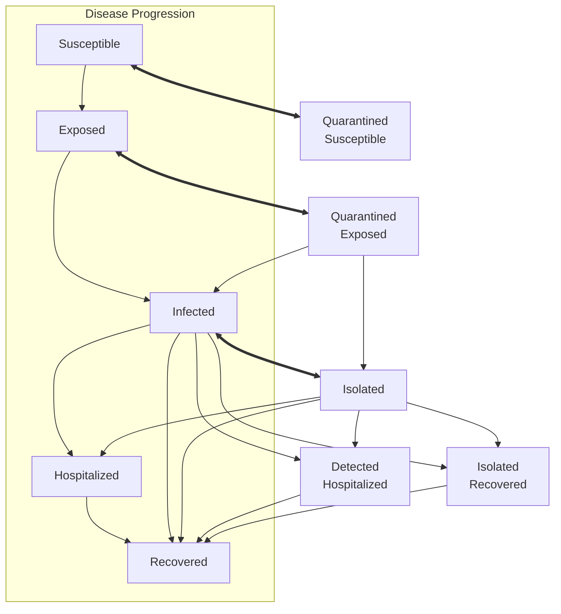
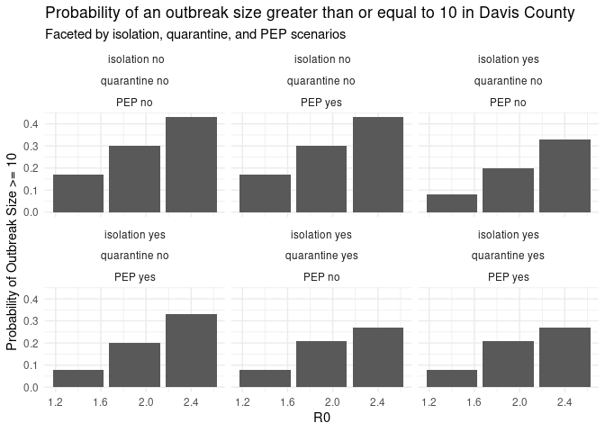

# Tabletop ABM for Davis County, Utah

This repository presents a tabletop agent-based model (ABM) for H5N1
spread in Davis County, Utah. The model utilizes age mixing data to
simulate H5N1 transmission dynamics under various intervention
scenarios, including isolation, quarantine, and post-exposure
prophylaxis (PEP).

This is not a real situation and is intended for educational purposes
only.

## Description of the model

The implemented model is a Susceptible Exposed Infectious Hospitalized
Recovered (SEIRH) model with mixing and quarantine features. The model
features what we call entities, which are subgroups of the population
defined by age groups and schools. School-age agents are assigned to
schools based on the population data, and the rest of the population is
assigned to age groups. The mixing patterns are given by an age-based
contact matrix based on the Polymod study.

The model features contact tracing, isolation of detected cases, and
quarantine of contacts. Detection happens with uncertainty (80% success
rate), and agents isolate and move to the quarantine states with
certainty (for now). The model also allows for the implementation of
post-exposure prophylaxis (PEP) for contacts of detected cases. The PEP
is implemented as a baseline tool that reduces the probability of
becoming infected and transmitting H5N1.

The quarantine process is as follows:

## Limitations of the model

The model has various assumptions that may not hold in real-world
scenarios:

1.  Like most, this model does not include a behavioral change from the
    agents’ perspective. This is something we cannot predict accurately.
    For example, parents deciding to send or not their kids to school,
    or how they might respond to public health messaging.

2.  The disease affects equally all age groups, which is not the case
    for many diseases. This may be important since we are incorporating
    a component of the population that is school-age, and they may have
    different susceptibility and infectiousness profiles compared to
    adults.

3.  We are not using real social network data, but rather a contact
    matrix that gives us the average number of contacts between age
    groups. This means that we are not capturing the heterogeneity in
    contact patterns that may exist in the real world. In previous
    research it has been demonstrated that social networks (clustering)
    may play an important role in the spread of infectious diseases, and
    this is not captured in our model.

## Running the model

To execute this model, it is recommended to run it in a high-performance
computing environment due to its computational intensity, especially
when simulating multiple scenarios. The model is fast, but the Davis
county population is large (over 350,000), and running multiple
simulations can be time-consuming on a standard personal computer.

The following diagram illustrates the compartments and transitions in
the SEIRH model:

## Summary of results

|  R0 | isolation     | quarantine     | pep     | Probability of Outbreak Size \>= 10 |
|----:|:--------------|:---------------|:--------|------------------------------------:|
| 1.4 | isolation no  | quarantine no  | PEP no  |                                0.17 |
| 1.4 | isolation no  | quarantine no  | PEP yes |                                0.17 |
| 1.4 | isolation yes | quarantine no  | PEP no  |                                0.08 |
| 1.4 | isolation yes | quarantine no  | PEP yes |                                0.08 |
| 1.4 | isolation yes | quarantine yes | PEP no  |                                0.08 |
| 1.4 | isolation yes | quarantine yes | PEP yes |                                0.08 |
| 1.9 | isolation no  | quarantine no  | PEP no  |                                0.30 |
| 1.9 | isolation no  | quarantine no  | PEP yes |                                0.30 |
| 1.9 | isolation yes | quarantine no  | PEP no  |                                0.20 |
| 1.9 | isolation yes | quarantine no  | PEP yes |                                0.20 |
| 1.9 | isolation yes | quarantine yes | PEP no  |                                0.21 |
| 1.9 | isolation yes | quarantine yes | PEP yes |                                0.21 |
| 2.4 | isolation no  | quarantine no  | PEP no  |                                0.43 |
| 2.4 | isolation no  | quarantine no  | PEP yes |                                0.43 |
| 2.4 | isolation yes | quarantine no  | PEP no  |                                0.33 |
| 2.4 | isolation yes | quarantine no  | PEP yes |                                0.33 |
| 2.4 | isolation yes | quarantine yes | PEP no  |                                0.27 |
| 2.4 | isolation yes | quarantine yes | PEP yes |                                0.27 |

Summary of the probability of an outbreak size greater than or equal to
10 for each scenario in Davis County.

## Links to the scenarios

The following table links to the reports generated for each of the
scenarios run for Davis County:

| R0  | Isolation | Quarantine | PEP | Link                                                                    |
|:----|:----------|:-----------|:----|:------------------------------------------------------------------------|
| 1.4 | no        | no         | no  | [View Report](scenarios/R0_1.4_isolation_no_quarantine_no.md)           |
| 1.4 | no        | no         | yes | [View Report](scenarios/R0_1.4_isolation_no_quarantine_no_pep_yes.md)   |
| 1.4 | yes       | no         | no  | [View Report](scenarios/R0_1.4_isolation_yes_quarantine_no.md)          |
| 1.4 | yes       | no         | yes | [View Report](scenarios/R0_1.4_isolation_yes_quarantine_no_pep_yes.md)  |
| 1.4 | yes       | yes        | no  | [View Report](scenarios/R0_1.4_isolation_yes_quarantine_yes.md)         |
| 1.4 | yes       | yes        | yes | [View Report](scenarios/R0_1.4_isolation_yes_quarantine_yes_pep_yes.md) |
| 1.9 | no        | no         | no  | [View Report](scenarios/R0_1.9_isolation_no_quarantine_no.md)           |
| 1.9 | no        | no         | yes | [View Report](scenarios/R0_1.9_isolation_no_quarantine_no_pep_yes.md)   |
| 1.9 | yes       | no         | no  | [View Report](scenarios/R0_1.9_isolation_yes_quarantine_no.md)          |
| 1.9 | yes       | no         | yes | [View Report](scenarios/R0_1.9_isolation_yes_quarantine_no_pep_yes.md)  |
| 1.9 | yes       | yes        | no  | [View Report](scenarios/R0_1.9_isolation_yes_quarantine_yes.md)         |
| 1.9 | yes       | yes        | yes | [View Report](scenarios/R0_1.9_isolation_yes_quarantine_yes_pep_yes.md) |
| 2.4 | no        | no         | no  | [View Report](scenarios/R0_2.4_isolation_no_quarantine_no.md)           |
| 2.4 | no        | no         | yes | [View Report](scenarios/R0_2.4_isolation_no_quarantine_no_pep_yes.md)   |
| 2.4 | yes       | no         | no  | [View Report](scenarios/R0_2.4_isolation_yes_quarantine_no.md)          |
| 2.4 | yes       | no         | yes | [View Report](scenarios/R0_2.4_isolation_yes_quarantine_no_pep_yes.md)  |
| 2.4 | yes       | yes        | no  | [View Report](scenarios/R0_2.4_isolation_yes_quarantine_yes.md)         |
| 2.4 | yes       | yes        | yes | [View Report](scenarios/R0_2.4_isolation_yes_quarantine_yes_pep_yes.md) |

Links to the scenario reports for Davis County

## Software

The simulations used the R package `epiworldR` version
`r`packageVersion(“epiworldR”)\`\`, which can be found at
<https://github.com/UofUEpiBio/epiworldR>, and R version R version 4.4.0
(2024-04-24).
