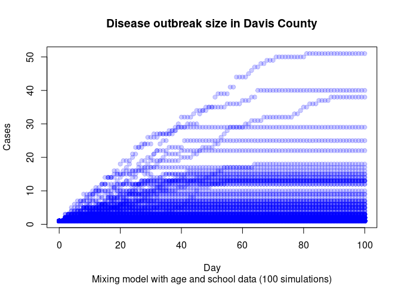
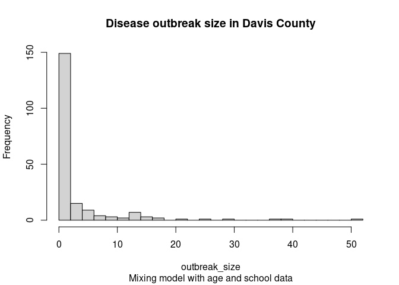

# Disease modeling with age mixing data: Davis County example

``` r
if (!exists("params")) {
  params <- list(
    nthreads = 10L,
    nsims = 20L,
    R0 = 1.9,
    quarantine = TRUE,
    isolation = TRUE,
    pep = TRUE
  )
}
```

``` r
library(epiworldR)
```

    Thank you for using epiworldR! Please consider citing it in your work.
    You can find the citation information by running
      citation("epiworldR")

``` r
library(data.table)
```

## Data preparation

Setting up an empty model for the moment, we will be using the data from
the davis county:

``` r
davis_pop <- fread("data/davis_population.csv")
davis_pop
```

         age_labels agepops agelims vacc_rate
             <char>   <int>   <int>     <int>
      1:     under1    4600       1         0
      2:       1to4   19840       4         0
      3:    5to11s1     673      11         0
      4:    5to11s2     360      11         0
      5:    5to11s3     626      11         0
     ---                                     
    138:  5to11s136     867      11         0
    139:     18to24   37273      24         0
    140:     25to44  108580      44         0
    141:     45to69   95226      69         0
    142:        70+   29039      90         0

Looking into the data

``` r
plot(
  davis_pop$agepops,
  x = davis_pop$agelims,
  xlab = "Age groups",
  ylab = "Population counts",
  main = "Davis County Population by Age Groups"
)
```


``` r
N <- sum(davis_pop$agepops)
```

We can take a look at the mixing matrix

``` r
davis_mixing_matrix <- readRDS("data/davis_mixing_matrix.rds")
image(
  davis_mixing_matrix,
  xlab = "Age groups",
  ylab = "Age groups",
  main = "Davis County Mixing Matrix"
)
```


The image shows a big diagonal in the middle which is expected as
school-age individuals will contact mostly with their peers (most of the
groups we have are schools).

## Model creating

Se will be assuming two values

- Incubation period is 2 to 5 days.
- Basic reproductive number will be between 1.5 and 3.

To compute the basic reproductive number, we use the following:

``` r
p_transmission <- 0.2
p_recovery <- 1/6
contact_rate <- params$R0 * p_recovery / p_transmission

# Figuring out if isolation and quarantine are enabled
quarantine_willingness <- ifelse(params$quarantine, 1.0, 0.0)
isolation_willingness  <- ifelse(params$isolation, 1.0, 0.0)
```

``` r
davis_model <- ModelSEIRMixingQuarantine(
  name                         = "Davis county",
  n                            = N,
  prevalence                   = 1/N,
  contact_rate                 = contact_rate,
  transmission_rate            = p_transmission,
  incubation_days              = 1.5,
  recovery_rate                = p_recovery,
  contact_matrix               = davis_mixing_matrix,
  hospitalization_rate         = 0.01,
  hospitalization_period       = 4,
  days_undetected              = 3, 
  quarantine_period            = 14,
  quarantine_willingness       = quarantine_willingness,
  isolation_willingness        = isolation_willingness,
  isolation_period             = 5,
  contact_tracing_success_rate = 0.8,
  contact_tracing_days_prior   = 7
)
```

We now start adding some of the entities from the population data:

``` r
add_entities_from_dataframe(
  model = davis_model,
  entities = davis_pop,
  col_name = "age_labels",
  col_number = "agepops",
  as_proportion = FALSE
)
```

Ensuring that the virus starts at a school similar to that of the case

``` r
# The target school has about 986 students
idx <- davis_pop[,which(abs(agepops - 968) < 10)][1]
preval <- numeric(nrow(davis_pop))
preval[idx] <- 1 

dist_fun <- distribute_virus_to_entities(
  prevalence = preval,
  as_proportion = FALSE
)

get_virus(davis_model, 0) |>
  set_distribution_virus(dist_fun)
```

Checking if the model includes post-exposure prophylaxis (PEP)

``` r
if (params$pep) {
  add_tool(
    davis_model,
    tool(
      name = "Post Exposure Prophylaxis",
      prevalence = .3,
      as_proportion = TRUE,
      susceptibility_reduction = 0.5,
      transmission_reduction = 0.8,
      recovery_enhancer = 0.0,
    death_reduction = 0.0
    )
  )
}
```

Running the model

``` r
davis_model |>
  run_multiple(
    ndays = 100,
    nsims = params$nsims,
    seed  = 8812,
    saver = make_saver("outbreak_size", "hospitalizations", "reproductive"),
    nthreads =params$nthreads
  )
```

    Starting multiple runs (200) using 50 thread(s)
    _________________________________________________________________________
    _________________________________________________________________________
    ||||||||||||||||||||||||||||||||||||||||||||||||||||||||||||||||||||||||| done.

Looking at the single simulation results

``` r
summary(davis_model)
```

    ________________________________________________________________________________
    ________________________________________________________________________________
    SIMULATION STUDY

    Name of the model   : SEIR with Mixing and Quarantine
    Population size     : 378472
    Agents' data        : (none)
    Number of entities  : 142
    Days (duration)     : 100 (of 100)
    Number of viruses   : 1
    Last run elapsed t  : 10.00s
    Total elapsed t     : 41.00s (200 runs)
    Last run speed      : 3.62 million agents x day / second
    Average run speed   : 183.22 million agents x day / second
    Rewiring            : off

    Global events:
     - Update infected individuals (runs daily)

    Virus(es):
     - Davis county

    Tool(s):
     - Post Exposure Prophylaxis

    Model parameters:
     - Avg. Incubation days         : 1.5000
     - Contact rate                 : 0.9167
     - Contact tracing days prior   : 7.0000
     - Contact tracing success rate : 0.8000
     - Days undetected              : 3.0000
     - Hospitalization period       : 4.0000
     - Hospitalization rate         : 0.0100
     - Isolation period             : 5.0000
     - Isolation willingness        : 0.0e+00
     - Prob. Recovery               : 0.1667
     - Prob. Transmission           : 0.2000
     - Quarantine period            : 14.0000
     - Quarantine willingness       : 0.0e+00

    Distribution of the population at time 100:
      - ( 0) Susceptible             : 378471 -> 378471
      - ( 1) Exposed                 :      1 -> 0
      - ( 2) Infected                :      0 -> 0
      - ( 3) Isolated                :      0 -> 0
      - ( 4) Detected Hospitalized   :      0 -> 0
      - ( 5) Quarantined Susceptible :      0 -> 0
      - ( 6) Quarantined Exposed     :      0 -> 0
      - ( 7) Isolated Recovered      :      0 -> 0
      - ( 8) Hospitalized            :      0 -> 0
      - ( 9) Recovered               :      0 -> 1

    Transition Probabilities:
     - Susceptible              1.00  0.00     -     -     -     -     -     -     -     -
     - Exposed                     -  0.50  0.50     -     -     -     -     -     -     -
     - Infected                    -     -  0.83     -     -     -     -     -     -  0.17
     - Isolated                    -     -     -     -     -     -     -     -     -     -
     - Detected Hospitalized       -     -     -     -     -     -     -     -     -     -
     - Quarantined Susceptible     -     -     -     -     -     -     -     -     -     -
     - Quarantined Exposed         -     -     -     -     -     -     -     -     -     -
     - Isolated Recovered          -     -     -     -     -     -     -     -     -     -
     - Hospitalized                -     -     -     -     -     -     -     -     -     -
     - Recovered                   -     -     -     -     -     -     -     -     -  1.00

``` r
# Extracting the results
ans <- davis_model |>
  run_multiple_get_results(
    freader = data.table::fread
  )

# Taking a look at the structure
str(ans)
```

    List of 3
     $ reproductive    :Classes 'epiworld_multiple_save_i', 'data.table' and 'data.frame':  1033 obs. of  6 variables:
      ..$ sim_num             : int [1:1033] 1 1 2 2 3 3 4 4 5 5 ...
      ..$ virus_id            : int [1:1033] 0 0 0 0 0 0 0 0 0 0 ...
      ..$ virus               : chr [1:1033] "Davis county" "Davis county" "Davis county" "Davis county" ...
      ..$ source              : int [1:1033] 26932 -1 27329 -1 26984 -1 26669 -1 26846 -1 ...
      ..$ source_exposure_date: int [1:1033] 0 0 0 0 0 0 0 0 0 0 ...
      ..$ rt                  : int [1:1033] 0 1 0 1 0 1 0 1 0 1 ...
      ..- attr(*, ".internal.selfref")=<externalptr> 
      ..- attr(*, "what")= chr "reproductive"
     $ outbreak_size   :Classes 'epiworld_multiple_save_i', 'data.table' and 'data.frame':  20200 obs. of  5 variables:
      ..$ sim_num      : int [1:20200] 1 1 1 1 1 1 1 1 1 1 ...
      ..$ date         : int [1:20200] 0 1 2 3 4 5 6 7 8 9 ...
      ..$ virus_id     : int [1:20200] 0 0 0 0 0 0 0 0 0 0 ...
      ..$ virus        : chr [1:20200] "Davis county" "Davis county" "Davis county" "Davis county" ...
      ..$ outbreak_size: int [1:20200] 1 1 1 1 1 1 1 1 1 1 ...
      ..- attr(*, ".internal.selfref")=<externalptr> 
      ..- attr(*, "what")= chr "outbreak_size"
     $ hospitalizations:Classes 'epiworld_multiple_save_i' and 'data.frame':    0 obs. of  6 variables:
      ..$ sim_num : logi(0) 
      ..$ date    : logi(0) 
      ..$ virus_id: logi(0) 
      ..$ tool_id : logi(0) 
      ..$ count   : logi(0) 
      ..$ weight  : logi(0) 
      ..- attr(*, "what")= chr "hospitalizations"
     - attr(*, "class")= chr [1:2] "epiworld_multiple_save" "list"

``` r
# Saving it
saveRDS(
  ans,
  file = sprintf(
    "R0_%.1f_isolation_%s_quarantine_%s.rds",
    params$R0,
    ifelse(params$isolation, "yes", "no"),
    ifelse(params$quarantine, "yes", "no")  
    )
)
```

We want to check that the index case is effectively one within the
school (entity 13):

``` r
index_cases <- ans$reproductive[
  (source_exposure_date == 0) & (source != -1)
  ]$source

# This all should be TRUE
index_lb_up <- davis_pop[, cumsum(agepops)][idx + c(-1,0)]
table(index_cases < index_lb_up[2] & index_cases > index_lb_up[1])
```


    TRUE 
     200 

We can also look at the distribution of the reproductive number for the
index case

``` r
index_cases <- ans$reproductive[
  (source_exposure_date == 0) & (source != -1)
  ]

r0s <- table(index_cases$rt) |> prop.table() |> addmargins()
data.table(
  Rt = names(r0s),
  Probability = as.numeric(r0s)
) |> knitr::kable(
  caption = paste(
    "Reproductive number distribution for the index case",
    "(Average R0:", round(mean(index_cases$rt), 2), ")"
  ),
  col.names = c("R0", "Probability")
)
```

| R0  | Probability |
|:----|------------:|
| 0   |       0.565 |
| 1   |       0.210 |
| 2   |       0.105 |
| 3   |       0.100 |
| 5   |       0.010 |
| 7   |       0.005 |
| 11  |       0.005 |
| Sum |       1.000 |

Reproductive number distribution for the index case (Average R0: 0.86 )

The function call will get us the results as a list of data.frames
(data.table objects in this case). We will use the `data.table` package
to manipulate the information.

``` r
# Converting into data.table format for convenience
outbreak_size <- ans$outbreak_size |> as.data.table()
hospitalizations <- ans$hospitalizations |> as.data.table()
```

## Outbreak size

Finally, since we are only interested about the final outbreak size (in
this case), can will collapse the data to get the total number of cases
at the final simulation day. Subsequently, we can plot the results using
the `hist` function:

``` r
# Aggregating to get the final
with(
  outbreak_size,
  {
    plot(
      x = date,
      y = outbreak_size,
      col = adjustcolor("blue", alpha.f = .2),
      pch = 19,
      ylab = "Cases",
      xlab = "Day",
      main = "Disease outbreak size in Davis County",
      sub = "Mixing model with age and school data (100 simulations)"
    )
})
```



We can also investigate the distribution of the final counts

``` r
# Aggregating to get the final
with(
  outbreak_size[date == max(date)],
  {
    hist(
      outbreak_size,
      main = "Disease outbreak size in Davis County",
      sub = "Mixing model with age and school data",
      breaks = 20
    )
})
```



``` r
outbreak_tot <- outbreak_size[
  date == max(date), .(total = sum(outbreak_size)), by = sim_num
  ]

# Creating a table showing the probability of these events
sizes <- c(10, 20, 50, 100, 200, 500, 1000, 2000)
sapply(sizes, function(sz) mean(outbreak_tot$total >= sz))
```

    [1] 0.08 0.05 0.01 0.00 0.00 0.00 0.00 0.00

``` r
knitr::kable(
  data.table(
    "Size" = sizes,
    "P(Greater or equal)" = sapply(sizes, function(sz) mean(outbreak_tot$total >= sz)),
    "P(Less or equal)" = sapply(sizes, function(sz) mean(outbreak_tot$total <= sz))
  ),
  caption = "Probability of outbreak sizes in Davis County",
  digits = 2
)
```

| Size | P(Greater or equal) | P(Less or equal) |
|-----:|--------------------:|-----------------:|
|   10 |                0.08 |             0.92 |
|   20 |                0.05 |             0.96 |
|   50 |                0.01 |             1.00 |
|  100 |                0.00 |             1.00 |
|  200 |                0.00 |             1.00 |
|  500 |                0.00 |             1.00 |
| 1000 |                0.00 |             1.00 |
| 2000 |                0.00 |             1.00 |

Probability of outbreak sizes in Davis County

## Hospitalizations

In the case of the hospitalizations, we can draw a similar figure. The
hospitalizations data contains the following information:

1.  Cases per virus (just measles in this case).
2.  Cases per tool (or the lack of). Information about “no tool” is
    recorded with a `tool_id == -1`.
3.  The counts (how many records in the data).
4.  Weights.

The weights attribute is to ensure that we take into consideration
counting individuals more than once. For instance, if a model has more
than one tool (not just vaccination), the individual who has two tools
would be included twice in `count`. Thus, if we wanted to count the raw
number of hospitalization cases, we would add across `weight`, but the
`count` variable yields how many individuals were hospitalized under
that combination of tool and virus id.

``` r
if (nrow(hospitalizations) > 0) {
  hosp_tot <- hospitalizations[, .(total = sum(count)), by = .(sim_num, tool_id)]
  hosp_tot[, status := fifelse(tool_id == -1, "Unvax", "Vax")]
  hosp_tot[, tool_id := NULL]
}
```

We can create a couple of boxplot to show how many cases we see per
vaccination status:

``` r
if (nrow(hospitalizations) > 0) {
  hosp_tot <- merge(
    hosp_tot[status == "Unvax", .(sim_num, unvax = total)],
    hosp_tot[status == "Vax", .(sim_num, vax = total)],
    all = TRUE
  )

  # Filling zeros
  hosp_tot[, unvax := fcoalesce(unvax, 0L)]
  hosp_tot[, vax := fcoalesce(vax, 0L)]

  hosp_tot[, .(vax, unvax)] |>
    as.matrix() |>
    boxplot(
      ylab = "Count",
      xlab = "Status",
      main = "Hospitalization per vaccination status",
      sub  = "Mixing model with age and school data (100 simulations)"
    )
}
```

## Final comments
